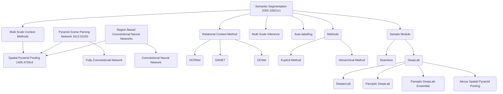

# Semantic Segmentation

_When Semantic Segmentation's architecture in a nutshell_
![architecture](https://mermaid.ink/svg/eyJjb2RlIjoiXG5ncmFwaCBURFxuICAgIFNTKFNlbWFudGljIFNlZ21lbnRhdGlvbiAyMDA1LjEwODIxdjEpIC0tPiBNU0NNKE11bHRpIFNjYWxlIENvbnRleHQgTWV0aG9kcylcbiAgICBNU0NNIC0tPiBTUFAoU3BhdGlhbCBQeXJhbWlkIFBvb2xpbmcgMTQwNi40NzI5djQpXG4gICAgUFNQTihQeXJhbWlkIFNjZW5lIFBhcnNpbmcgTmV0d29yayAxNjEyLjAxMTA1KSAtLT4gU1BQXG4gICAgUFNQTiAtLT4gRkNOKEZ1bGx5IENvbnZvbHV0aW9uYWwgTmV0d29yaylcbiAgICBSQ05OKFJlZ2lvbiBCYXNlZCBDb252b2x1dGlvbmFsIE5ldXJhbCBOZXR3b3JrcykgLS0-IFNQUFxuICAgIFJDTk4gLS0-IENOTihDb252b2x1dGlvbmFsIE5ldXJhbCBOZXR3b3JrKVxuXG4gICAgU1MgLS0-IFJDVChSZWxhdGlvbmFsIENvbnRleHQgTWV0aG9kKVxuICAgIFJDVCAtLT4gT0NSTihPQ1JOZXQpXG4gICAgUkNUIC0tPiBETihEQU5FVClcbiAgICBSQ1QgLS0-IE9DTihPQ05ldClcbiAgICBcbiAgICBTUyAtLT4gTVNJKE11bHRpIFNjYWxlIEluZmVyZW5jZSlcbiAgICBTUyAtLT4gQUwoQXV0by1sYWJlbGxpbmcpXG5cbiAgICBTUyAtLT4gTVQoTWV0aG9kcylcbiAgICBNVCAtLT4gRU0oRXhwbGljaXQgTWV0aG9kKVxuICAgIE1UIC0tPiBITShIaWVyYXJjaGljYWwgTWV0aG9kKVxuXG4gICAgU1MgLS0-IFNNKFNhbXBsZSBNb2R1bGUpXG4gICAgU00gLS0-IFNMKFNlYW1sZXNzKVxuICAgIFNNIC0tPiBETChEZWVwTGFiKVxuICAgIERMIC0tPiBERUwoRGVlcGVyTGFiKVxuICAgIERMIC0tPiBQREwoUGFub3B0aWMgRGVlcExhYilcbiAgICBETCAtLT4gUERMRShQYW5vcHRpYyBEZWVwTGFiIEVuc2VtYmxlKVxuXG4gICAgREwgLS0-IEFTUFAoQXRyb3VzIFNwYXRpYWwgUHlyYW1pZCBQb29saW5nKSIsIm1lcm1haWQiOnt9LCJ1cGRhdGVFZGl0b3IiOmZhbHNlfQ)

# Semantic segmentation 1511.03339

- Multi scale context

    Methods:

    - Skip-net (look like skip layers, blocks)
    - Share-net (shar weight)
    - Model Particularly
        - Attention model
            - Soft
            - Self
            - Hard
        - Adapt 1412.7062 + shared network
        - Implement a soft attention model to generalize average- and max-pooling over scales,
- Deeplab https://phamdinhkhanh.github.io/2020/06/18/DeepLab.html
    - Atrous Convolution
    - A soft attention model
